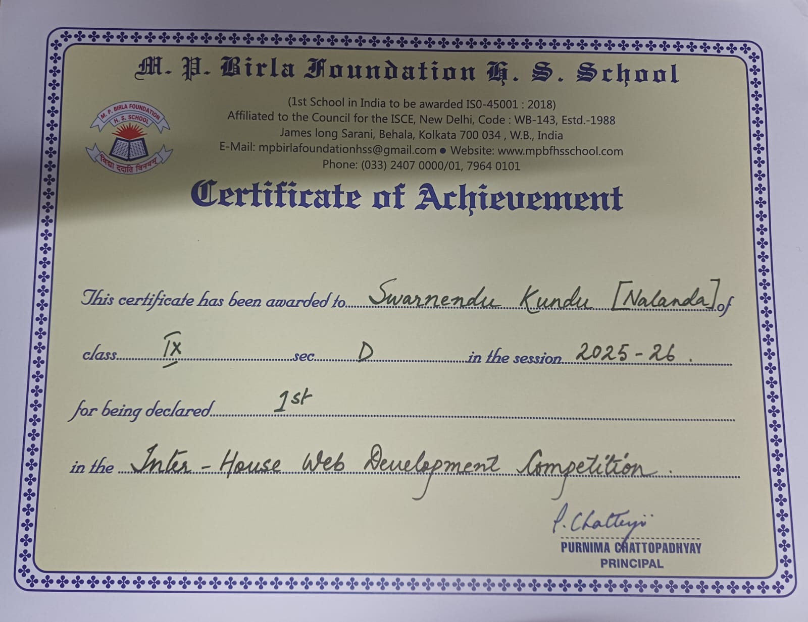
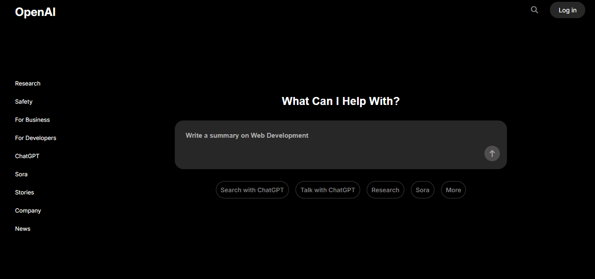
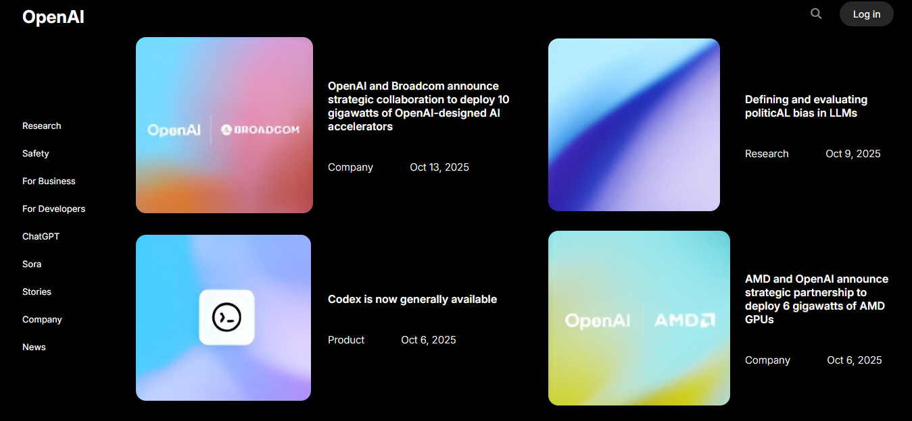
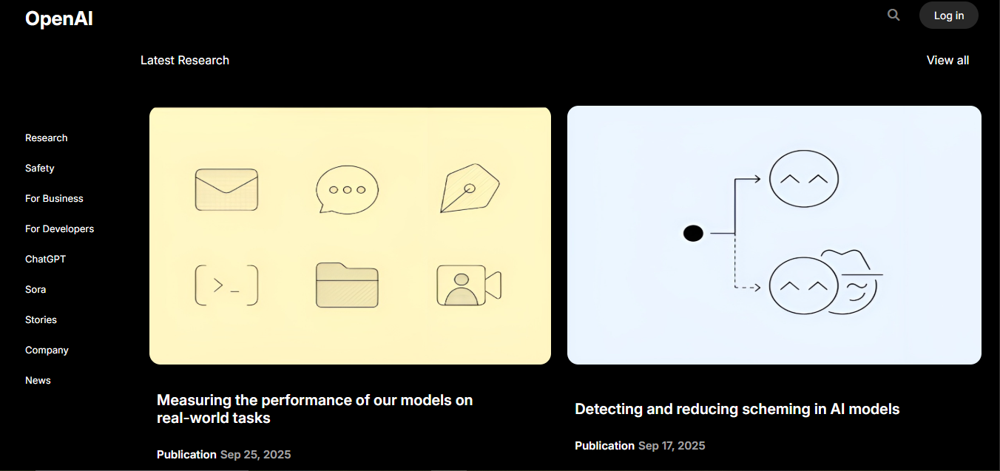
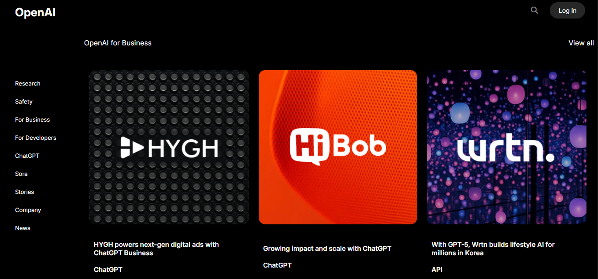
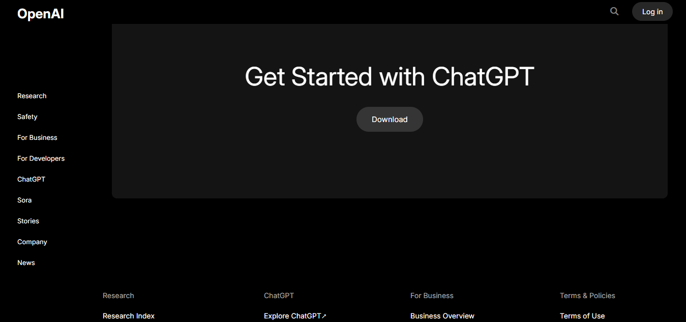

# OpenAI Frontend Clone 🚀

A high-fidelity, hand-coded clone of the OpenAI website's frontend. This project was developed live during an **Inter-House Web Development Competition**, where it secured **1st Place**.

## 🏆 Achievement
I am proud to share that this project won the **Gold Medal (1st Position)** in the 2025-26 Inter-House Web Development Competition at M. P. Birla Foundation H. S. School. The entire codebase was written from scratch on the spot within the competition timeframe.

---

## 💻 Project Overview
The goal of this project was to replicate the sleek, dark-themed UI/UX of OpenAI's official website using clean, semantic HTML and modern CSS.

### Key Features:
* **Pixel-Perfect Design:** Accurate recreation of the navigation, hero sections, and typography.
* **Responsive Layout:** Designed to look great across different screen sizes.
* **Modern Aesthetics:** Deep black backgrounds with vibrant, rounded-corner cards and high-quality imagery.
* **Handwritten Code:** No page builders or external templates; 100% manual implementation.

---

## 📸 Screenshots

### 1. Hero Section & Search
The landing page featuring the iconic search bar and minimalist sidebar navigation.

### 2. Collaboration & Announcements
Layout showcasing strategic partnerships and technical milestones.

### 3. Research Insights
Grid-based display for latest research publications and safety documentation.

### 4. Enterprise & Business
Clean representation of the "OpenAI for Business" ecosystem.

### 5. Call to Action
The "Get Started" section with a integrated footer navigation.

---

## 🛠️ Built With
* **HTML5:** For structured, semantic web content.
* **CSS3:** For custom styling, Flexbox/Grid layouts, and responsiveness.

## 👤 Author
**Swarnendu Kundu**
